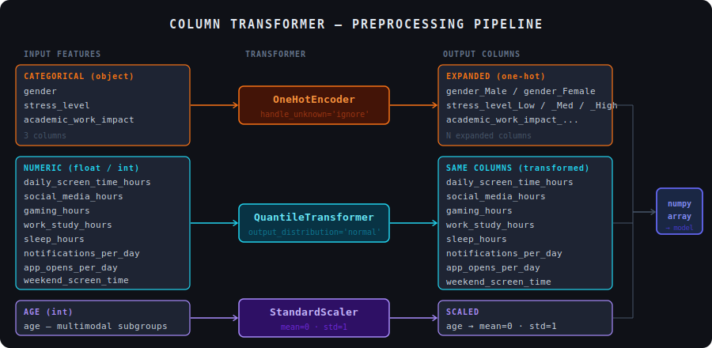
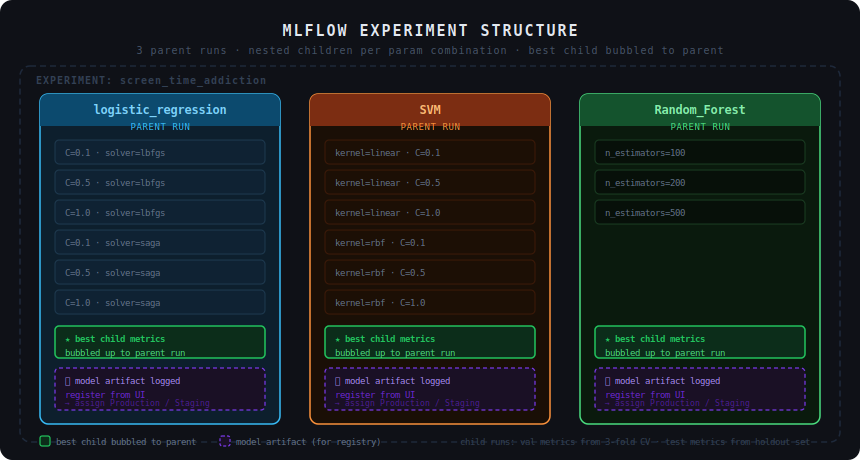
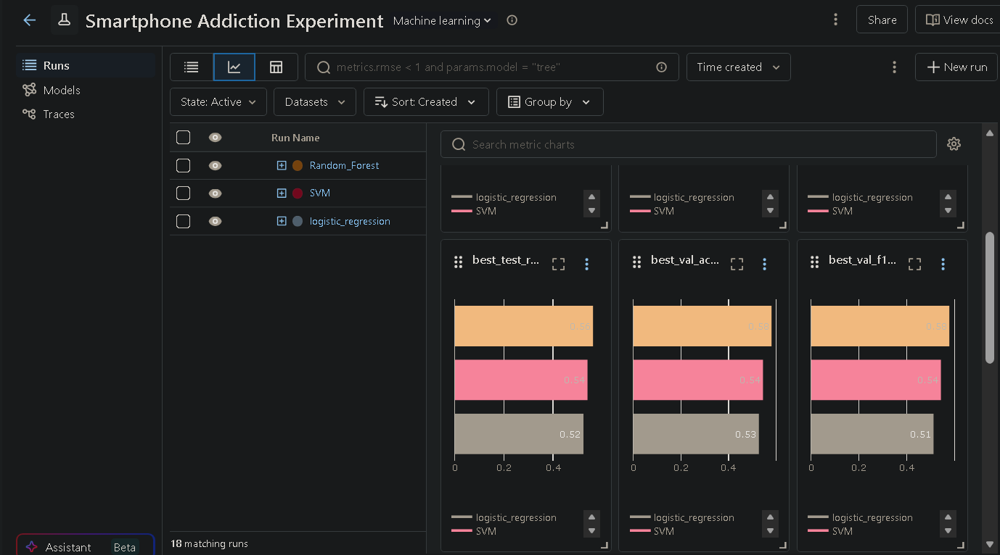
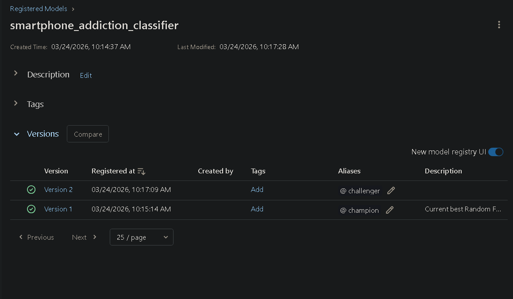
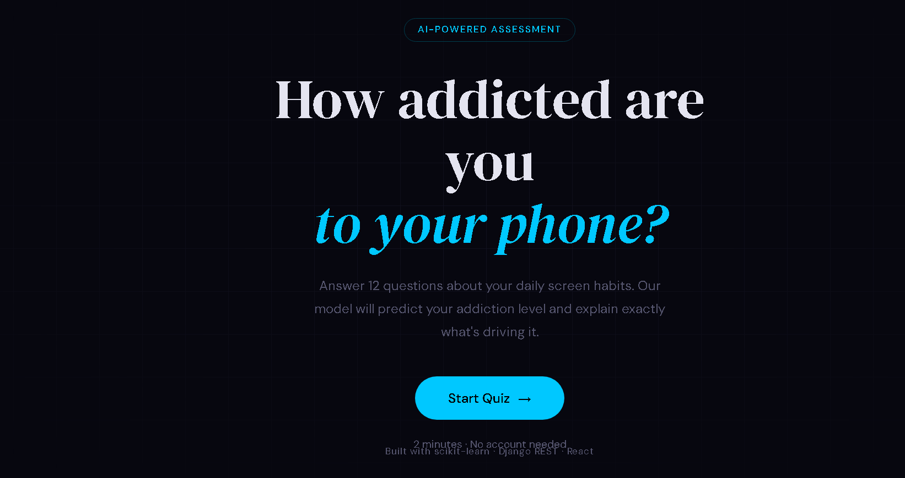
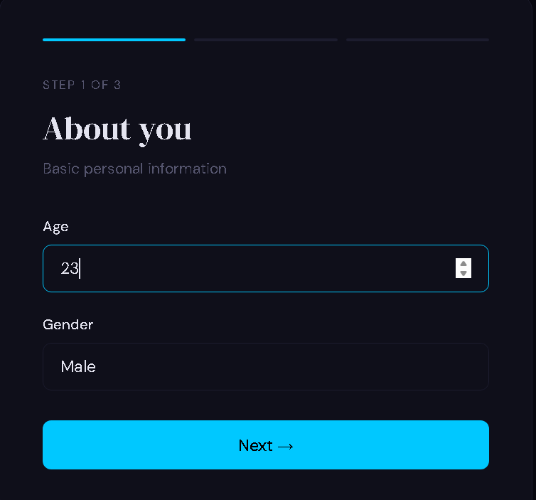
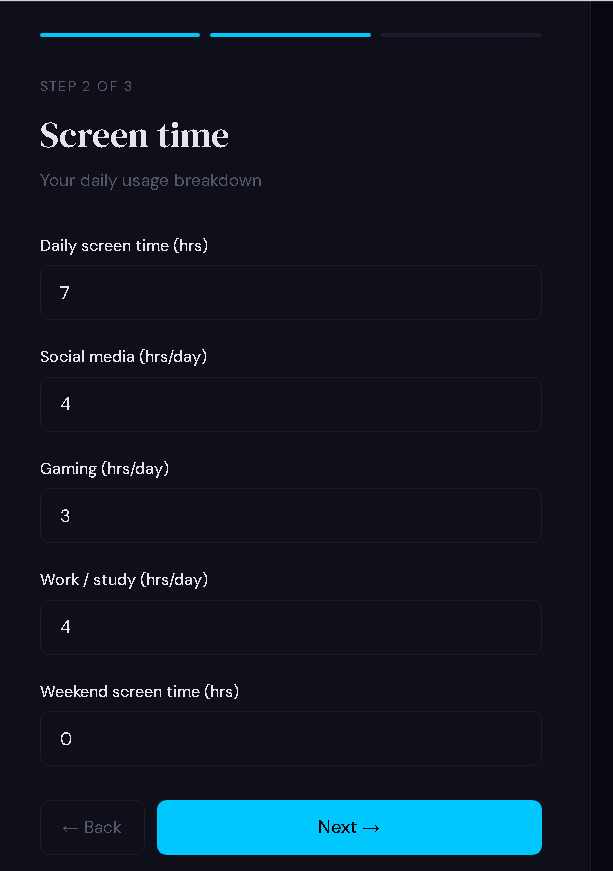
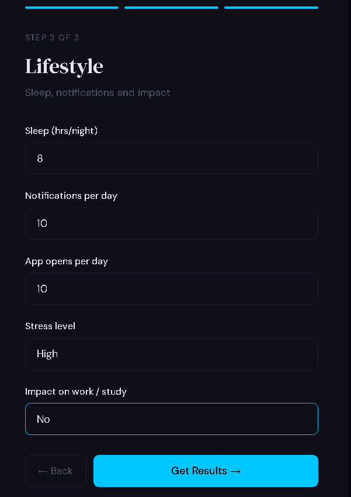
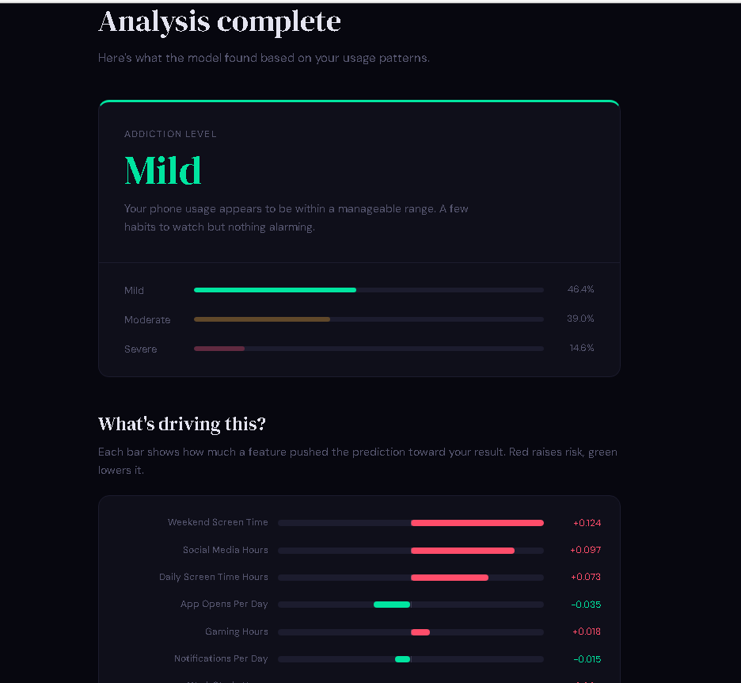

# 📱 Smartphone Addiction Prediction — End to End ML Pipeline

Predicts addiction level (`Mild`, `Moderate`, `Severe`) from smartphone usage behavior data. Built with scikit-learn, tracked with MLflow. Backend handled with Django Django Rest Framework, Frontend with React

---

## 📁 Project Structure

```text

├── backend/                  # Django project configuration (settings, wsgi, asgi)
├── phone_addiction/          # Main Django application
│   ├── ml/                   # Inference logic (predict.py, shap_explainer.py)
│   ├── serializers.py        # DRF serializers for data validation & formatting
│   ├── views.py              # API endpoint controllers
│   └── urls.py               # App-level routing
├── frontend/                 # React UI (Vite)
├── ml/                       # Exported model artifacts (.pkl, .joblib)
├── notebooks/                # ML pipeline notebooks (EDA,preprocessing, training and experimenting)
├── .env                      # Environment variables (not tracked)
├── manage.py                 # Django entry point
└── requirements.txt          # Python dependencies
---
```
## 🔧 Preprocessing Pipeline

Features are split into three groups and handled by a `ColumnTransformer`:



| Group | Columns | Transformer | Why |
|---|---|---|---|
| Categorical | `gender`, `stress_level`, `academic_work_impact` | `OneHotEncoder` | converts strings to numeric |
| Numeric | all float/int except age | `QuantileTransformer` | uniform → normal distribution |
| Age | `age` | `StandardScaler` | multimodal — preserves group structure |

> `age` is handled separately because it shows meaningful subgroups (teens, young adults, adults). Applying `QuantileTransformer` would flatten that signal, so `StandardScaler` is used instead to just normalize the range.

The pipeline is fit **only on training data** and applied to test data — no leakage.


---

## 🎯 Target Variable

`addiction_level` — 3 classes encoded with `LabelEncoder`:

```
Mild     → 0
Moderate → 1
Severe   → 2
```

Class distribution in training set:
```
Moderate (1): 2299  (most frequent)
Severe   (2): 1947
Mild     (0): 1098
```

---

## 🧪 Model Training & MLflow Experiment

Three model families were trained, each with a grid of hyperparameters tracked as **nested runs** in MLflow.



### Models Comparison Charts on MLFlow:


### Registered Models:


### Models & Grids

```python
models = {
    "logistic_regression": {
        "model": LogisticRegression,
        "params": { "C": [0.1, 0.5, 1], "solver": ["lbfgs", "saga"], "random_state": [42] }
    },
    "SVM": {
        "model": SVC,
        "params": { "kernel": ["linear", "rbf"], "C": [0.1, 0.5, 1], "random_state": [42] }
    },
    "Random_Forest": {
        "model": RandomForestClassifier,
        "params": { "n_estimators": [100, 200, 500], "random_state": [42] }
    }
}
```

### Validation Strategy

Each child run uses **3-fold cross-validation on the training set** via `cross_validate`, logging:

- `val_accuracy_mean` / `val_f1_mean` / `val_precision_mean` / `val_recall_mean`

Then fits on the full training set and evaluates on the holdout test set:

- `test_accuracy` / `test_f1` / `test_precision` / `test_recall`

> The test set is **never used for model selection** — only for final evaluation. Best model is chosen based on `val_accuracy_mean`.

### Nested Run Structure

```
experiment: screen_time_addiction
│
├── logistic_regression          ← parent run
│   ├── lr__C=0.1__solver=lbfgs  ← child (all metrics logged)
│   ├── lr__C=0.5__solver=lbfgs
│   ├── ...
│   └── best_* metrics bubbled up to parent + model artifact logged
│
├── SVM                          ← parent run
│   ├── SVM__kernel=linear__C=0.1
│   ├── ...
│   └── best_* metrics bubbled up to parent + model artifact logged
│
└── Random_Forest                ← parent run
    ├── Random_Forest__n_estimators=100
    ├── ...
    └── best_* metrics bubbled up to parent + model artifact logged
```

The best child per model is identified during the loop and its metrics are **re-logged to the parent run** with a `best_` prefix. This means you can compare the three parent runs directly in the MLflow UI to pick the top 2 models for the registry.


---
---

## ⚙️ Backend API (Django + DRF)

The backend serves the trained ML model via a REST API. It handles incoming JSON payloads, validates them using `serializers.py`, processes the data through the saved `ColumnTransformer`, generates predictions, and calculates feature importance for that specific user.

### Core Endpoint

`POST /api/predict/`

Accepts a JSON payload containing the user's smartphone usage data. 

**Response Profile:**
* `prediction`: The predicted class (`Mild`, `Moderate`, `Severe`)
* `probabilities`: Confidence scores for each class.
* `shap_values`: An ordered list of features and their impact scores for the specific prediction.

---

## 📊 Model Explainability (SHAP)

Machine learning shouldn't be a black box. This project uses **SHAP (SHapley Additive exPlanations)** via `TreeExplainer` to provide real-time, local interpretability for every prediction made by the Random Forest model.

Instead of just returning "Severe Addiction", the API calculates the exact contribution of each feature (e.g., `screen_on_time`, `social_media_usage`) for that specific user. These values are sorted by absolute impact and sent to the frontend to be rendered dynamically.

---

## 💻 Frontend (React)

The frontend is a responsive React application that collects user data, handles API communication, and visualizes both the prediction and the SHAP explainability data.

### 📸 Screenshots


  — *Home page*

 — *Input form for basic personal info.*
 — *Input form for smartphone usage metrics.*
 — *Input form for lifestyle metrics.*


  — *Prediction results and dynamic SHAP bar chart.*

---

## 🚀 Running the Web Application Locally

### 1. Environment Variables Setup

To avoid hardcoding sensitive information in `settings.py`, create a file named `.env` in the root of the project (in the same folder as `manage.py`) and add the following lines:

```env
# .env
DJANGO_SECRET_KEY=your-local-secret-key-string-here
DEBUG=True
ALLOWED_HOSTS=127.0.0.1,localhost
```


## ▶️ Running the Project

The project is split into the Machine Learning pipeline and the Web Application. You will need separate terminal windows to run the servers simultaneously.

### 1. Run the ML Pipeline

First run:
1. Preprocess the dataset
notebooks/02_preprocessing.ipynb

 2. Train models and log metrics to MLflow
notebooks/03_training_and_experimenting.ipynb


Execute these scripts from the root directory:

```bash
# 0. Install Python dependencies
pip install -r requirements.txt
#  (Optional) Launch the MLflow UI to view experiment results
mlflow ui
# Open [http://127.0.0.1:5000](http://127.0.0.1:5000) in your browser


# Activate your virtual environment first if you haven't already
# Start the Django development server
python manage.py runserver


cd frontend

# Install frontend dependencies (only required the first time)
npm install

# Start the Vite development server
npm run dev